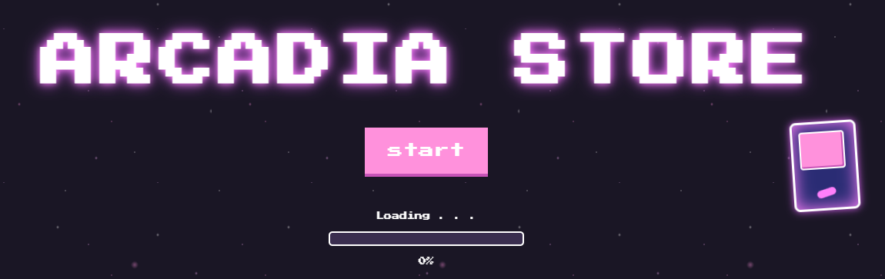
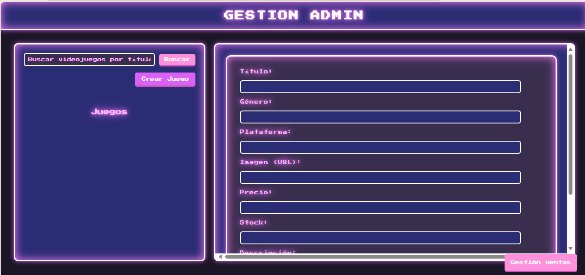

# 🎮 Arcadia Store — Front-End  



## 🕹️ Descripción  
**Arcadia Store** es una tienda virtual con estética *retro arcade* inspirada en los años 80.  
El proyecto está desarrollado con **HTML, CSS y JavaScript puro**, y simula una experiencia de compra digital con estilo *neón* y animaciones interactivas.  

Incluye un **panel de administración**, una **pantalla de selección** y una **interfaz visual de ventas** con una atmósfera pixelada y futurista.

---

## 🧩 Estructura del proyecto
```
ARCADIA-FRONT-END/
│
├── css/
│   ├── root.css            # Variables globales (colores, fuentes, efectos neón)
│   ├── style.css           # Estilos generales de la página principal
│   ├── styleAdmin.css      # Estilos del panel de administración
│
├── icon/
│   ├── arcade.ico
│   ├── dart.ico
│   ├── game-controller.ico
│   └── game.ico            # Íconos utilizados en distintas secciones
│
├── pages/
│   ├── admin.html          # Panel de administración de juegos
│   ├── select.html         # Pantalla de selección para el administrador
│   └── ventas.html         # Página de registro de ventas
│
├── scripts/
│   ├── script.js           # Lógica principal (inicio o pantalla de carga)
│   ├── script_admin.js     # Funciones CRUD del panel de administración
│   └── script_sales.js     # Lógica de la sección de ventas
│
├── preview/                # 📸 Capturas de pantalla (para este README)
│   ├── loading.png
│   ├── select.png
│   └── admin.png
│
├── index.html              # Página principal
└── README.md               # Documentación del proyecto
```

---

## 🧠 Funcionalidades principales

🎮 **Pantalla de carga tipo videojuego**  


🕹️ **Pantalla de selección de administrador**  


💾 **Gestión de juegos** (crear, editar y eliminar)  


🛍️ **Simulación de ventas** con interfaz animada  
📱 **Diseño responsive** con tipografía pixel art  
🌈 **Estilo retro-neón** con efectos dinámicos  

---

## 🎨 Estilo visual

Todo el sistema visual está controlado desde `root.css`, que define la **paleta arcade neón**, la **tipografía pixelada**, y los **efectos luminosos**:

```css
:root {
  /* Colores base */
  --color-bg: #1a1625;
  --color-white: #ffffff;
  --color-pink: #ff91dc;
  --color-pink-light: #ffb3ff;
  --color-pink-deep: #c754b7;
  --color-purple: #d962f4;
  --color-blue-dark: #2a2c74;
  --color-gray-dark: #3a2e4f;

  --font-arcade: 'Press Start 2P', cursive;
}
```

El resultado es una estética inspirada en los *salones arcade de los 80s*, combinando colores brillantes, sombras difusas y animaciones suaves.

---

## 🛠️ Tecnologías utilizadas
| Tecnología | Uso principal |
|-------------|----------------|
| 🧱 **HTML5** | Estructura semántica y contenido de la app |
| 🎨 **CSS3** | Estilos neón, diseño responsive, efectos visuales |
| ⚡ **JavaScript (ES6+)** | Interactividad, manejo de datos, simulación de eventos |


---

## 🚀 Cómo ejecutar el proyecto

1. Clona este repositorio:
   ```bash
   git clone https://github.com/Andre07g/arcadia-front-end.git
   ```

2. Abre la carpeta del proyecto en tu editor (por ejemplo, **VS Code**).

3. Abre el archivo `index.html` en tu navegador para visualizar la pantalla principal.

4. Navega a la carpeta `/pages/` para acceder a las otras secciones:
   - `/pages/select.html` → menú de selección del administrador  
   - `/pages/admin.html` → gestión de juegos  
   - `/pages/ventas.html` → simulación de ventas  

---


## 💖 Créditos
Desarrollado con 💡 pasión por: 

* [Andres Leal](https://github.com/Andre07g)
* [Karolain Reyes](https://github.com/KarolainReyes)
* [Joan Sebastian Gomez](https://github.com/Sebas404040)  
* [Michel Rodriguez](https://github.com/michelrodriguez05)

Diseño y código inspirados en la estética **retro-neón arcade**.  
> _“Press Start to Play”_

---

<p align="center">
  <a href="https://andre07g.github.io/Arcadia-front-end/" target="_blank">
    
  </a>
</p>
